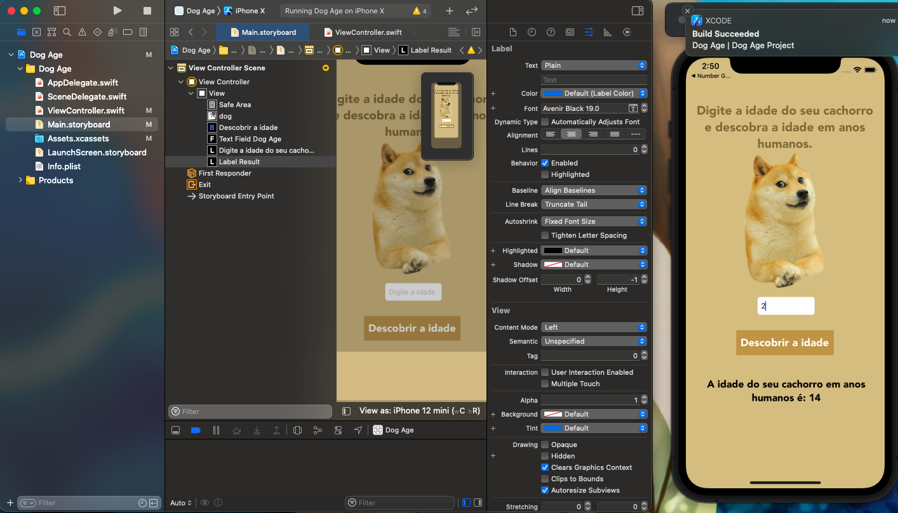

# DOG AGE 🐶

## 📋 Descrição

Nesse repositório está o projeto que desenvolvi para aprender e fixar os conhecimentos em Swift usando Storyboard.

O aplicativo trata de uma interface bem simples cujo o proposito é mensurar a idade do seu cachorro em anos humanos partindo so suposto que cada 1 ano de cachorro vale 7 anos humanos.

=)

## 📲 ScreenShots

## 🖥️ Tecnologias

- Swift
- Storyboard

## 🎨 Projeto
*✓ Finalizado (sujeito a melhorias)*

